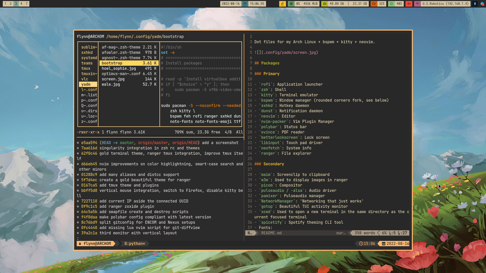

# Maik's .files

Dot files for my Arch Linux + bspwm + kitty + neovim.



## Packages

### Primary

- `rofi`: Application launcher
- `zsh`: Shell
- `kitty`: Terminal emulator
- `bspwm`: Window manager (rounded corners fork, see below)
- `sxhkd`: Hotkey daemon
- `dunst`: Notification daemon
- `neovim`: Editor
- `nvim-packer`: Vim Plugin Manager
- `polybar`: Status bar
- `evince`: PDF reader
- `betterlockscreen`: Lock screen
- `libinput`: Touch pad driver
- `neofetch`: System info
- `ranger`: File explorer

### Secondary

- `maim`: Screenclip to clipboard
- `w3m`: Used to display images in ranger
- `picom`: Compositor
- `pulseaudio / -alsa`: Audio driver
- `pamixer`: Pulseaudio manager
- `NetworkManager`: 'Networking that just works'
- `gotop`: Beautiful TUI activity monitor
- `xcwd`: Used to open a new terminal in the same directory as the current focused terminal
- `spicetify`: Spotify theming CLI tool
- Fonts:
  - JetBrains Mono (`ttf-jetbrains-mono`)
  - noto-fonts
  - ttf-font-awesome
  - icomoon-feather

## Installation

Installation and the dotfiles are to be managed with [yadm](https://yadm.io/), thus installation is done through cloning the repository using `yadm clone`, and then confirm running the bootstrapping script when prompted to. If not prompted after cloning, executing the bootstrapping script can be done at any time with `yadm bootstrap`.

Thus, if you have a completely fresh install of arch, do the following:

```sh
curl -fLo /usr/local/bin/yadm https://github.com/TheLocehiliosan/yadm/raw/master/yadm && chmod a+x /usr/local/bin/yadm
yadm clone https://github.com/Maik93/dotfiles
# yadm bootstrap # usually unnecessary (it's automatically called by the clone process)
```

The bootstrapping script should setup and install most things, and get you a completely usable system. There are, however, still some further configuration needed for some of the applications that I use. The following sub-sections will cover these extra setups.

### Neovim setup

Simply open `nvim` and run `:PackerCompile` (during the first run ONLY), then `PackerInstall`.

## Device/hardware specific settings

These are some of the tweaks I've made for my specific setup, most of them are to optimize battery lifetime.

### Kernel parameters

Below are the kernel parameters I would pass to all linux installations, but I think they depends on the hardware (mine is an MSI GS63 8RE).

```
acpi_osi=Linux
```

