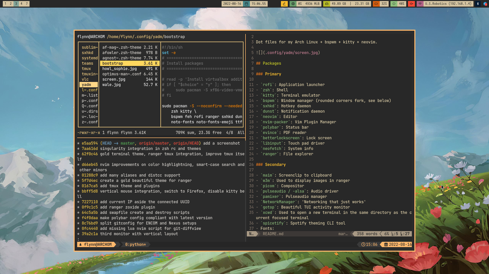

# Maik's .files

Dot files for... anything!

!NOTE: for the GUI version, switch to `linux-gui` branch!



## Setup

Dotfiles are managed with [yadm](https://yadm.io/), that needs to be installed first.
You can then setup your system by cloning this repository with `yadm clone`.

### Install yadm
NOTE: *do not* do it with apt! It is usually an outdated version, get it from the official github instead with the following command:
```sh
sudo curl -fLo /usr/local/bin/yadm https://github.com/TheLocehiliosan/yadm/raw/master/yadm && sudo chmod a+x /usr/local/bin/yadm
```

### Clone this repo as your dotfiles
```sh
yadm clone https://github.com/Maik93/dotfiles
```
If prompted, do not execute bootstrap scripts just after cloning, since there is some configuration to be done first.

### Configure your scenario

Choose the right classes, mixing together OS and scenario.
If nothing is supplied, everything is written for Archlinux with BSWM.

Set OS among:
- `mac`
- `arch`
- `ubuntu`
- `debian`

Optionally, set a scenario:
- `tui`: non-graphical target (valid only in `linux-gui` branch);
- `wsl`: non-graphical, inside WSL2 (valid only when combined with `arch` OS).

```bash
yadm config local.class <os-type> # like 'arch' or 'ubuntu'
yadm config --add local.class <secondary-stuff> # like 'tui' or 'wsl'

yadm alt # refresh links based on the selected classes

yadm bootstrap # install needed dependencies, based on the configuration just set
```

The bootstrapping script should setup and install most things, and get you a completely usable system.
There are, however, still some further configuration needed for some of the applications that I use. The following sub-sections will cover these extra setups.

### Neovim setup

Lazy.nvim will auto-bootstrap on first run. Simply open `nvim` and it will automatically install all plugins from `~/.config/nvim/lua/plugins/`.

Common commands:
- `:Lazy` - Open the Lazy UI to manage plugins
- `:Lazy update` - Update all plugins
- `:Lazy sync` - Install, update, and clean plugins
