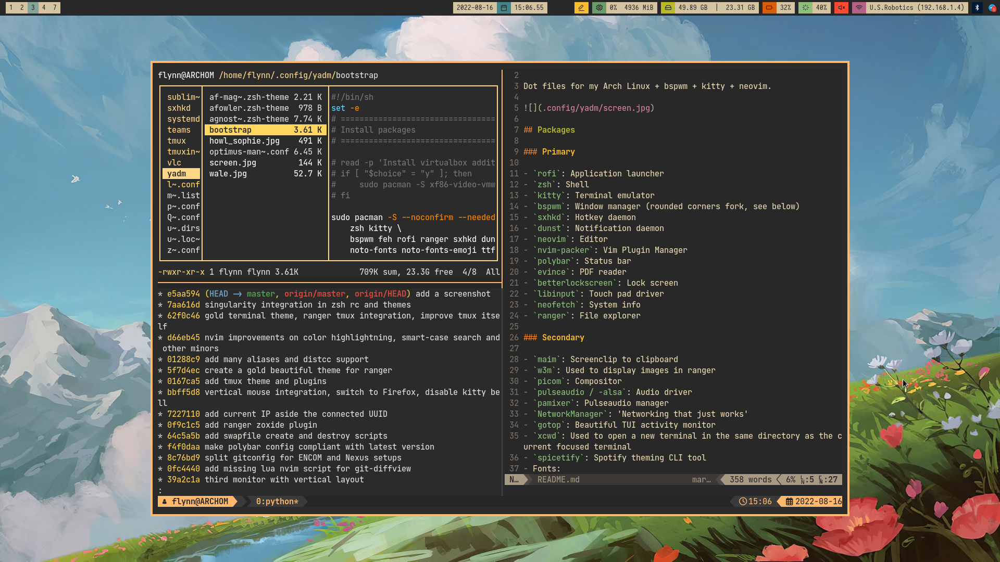

# Maik's .files

Dot files for... anything!

!NOTE: for the GUI version, switch to `linux-gui` branch!



## Setup

Dotfiles are managed with [yadm](https://yadm.io/), that needs to be installed first.
You can then setup your system by cloning this repository with `yadm clone`.

### Install yadm

NOTE: *do not* do it with apt! It is usually an outdated version, get it from the official github instead with the following command:

```
sudo curl -fLo /usr/local/bin/yadm https://github.com/TheLocehiliosan/yadm/raw/master/yadm && sudo chmod a+x /usr/local/bin/yadm
```

### Clone this repo as your dotfiles

```
yadm clone https://github.com/Maik93/dotfiles
```

If prompted, do not execute bootstrap scripts just after cloning, since there is some configuration to be done first.

### Configure your scenario

Choose the right classes, mixing together OS and scenario.
If nothing is supplied, everything is written for Archlinux with BSWM.

Set OS among:

- `mac`
- `arch`
- `ubuntu`
- `debian`
- `centos` (RPM/dnf-based, tested on CentOS Stream — see [CentOS notes](#centos-notes) below)

Optionally, set a scenario:

- `tui`: non-graphical target (valid only in `linux-gui` branch);
- `wsl`: non-graphical, inside WSL2 (valid only when combined with `arch` OS).

```
yadm config local.class <os-type> # like 'arch' or 'ubuntu'
yadm config --add local.class <secondary-stuff> # like 'tui' or 'wsl'

yadm alt # refresh links based on the selected classes

yadm bootstrap # install needed dependencies, based on the configuration just set
```

The bootstrapping script should setup and install most things, and get you a completely usable system.
There are, however, still some further configuration needed for some of the applications that I use. The following sub-sections will cover these extra setups.

### Neovim setup

Lazy.nvim will auto-bootstrap on first run. Simply open `nvim` and it will automatically install all plugins from `~/.config/nvim/lua/plugins/`.

Common commands:

- `:Lazy` - Open the Lazy UI to manage plugins
- `:Lazy update` - Update all plugins
- `:Lazy sync` - Install, update, and clean plugins

### CentOS notes

`bootstrap##class.centos` mirrors `bootstrap##class.debian`/`bootstrap##class.arch`, adapted
for an RPM/dnf-based system. A few things work differently from the apt/pacman variants,
so if you're on CentOS (or a close RPM cousin like Rocky/Alma) read this first:

- **EPEL is required.** Packages like `ripgrep`, `bat`, `fzf`, `jq`, `p7zip`, `ImageMagick`,
  `ncdu` and `duf` aren't in the CentOS base/AppStream repos. The script installs
  `epel-release` and runs `dnf makecache` before anything else.
- **CentOS Stream 8/9**: some packages live in the `crb` (Stream 9) or `powertools`
  (Stream 8) repo, disabled by default. If a package fails to install, enable it first:
  ```
  sudo dnf config-manager --set-enabled crb        # Stream 9
  sudo dnf config-manager --set-enabled powertools  # Stream 8
  ```
- **zoxide** isn't reliably packaged for RPM/EPEL, so — same as the debian variant — it's
  installed via the official install script rather than through the package manager.
- **yazi** isn't packaged for RPM at all. The script downloads the latest prebuilt Linux
  binary (`yazi` + `ya`) from the [GitHub releases page](https://github.com/sxyazi/yazi/releases)
  and installs it to `/usr/local/bin`. This means yazi updates on CentOS need a manual
  re-run of that section — there's no `dnf upgrade` path for it, unlike arch/debian.
- `program_list` (`ncdu`, `duf`) is installed with `dnf install -y` instead of `apt`/`pacman`;
  both are available via EPEL.
- Everything after package installation — oh-my-zsh setup, theme/plugin symlinks
  (`afowler.zsh-theme`, `elapsed-time.plugin.zsh`), ranger/tmux plugin clones, `chsh` — is
  unchanged from the debian variant, since none of it is package-manager-specific.

Known limitations: only tested against CentOS Stream (dnf-based) — RHEL/Rocky/Alma should
behave the same since they share the package manager and EPEL compatibility, but this
hasn't been verified. The yazi binary install has no uninstall/upgrade hook; removing it
means manually deleting `/usr/local/bin/yazi` and `/usr/local/bin/ya`.

## About

My personal linux configurations, both for Archlinux with and without GUI, and Ubuntu in WLS2.
